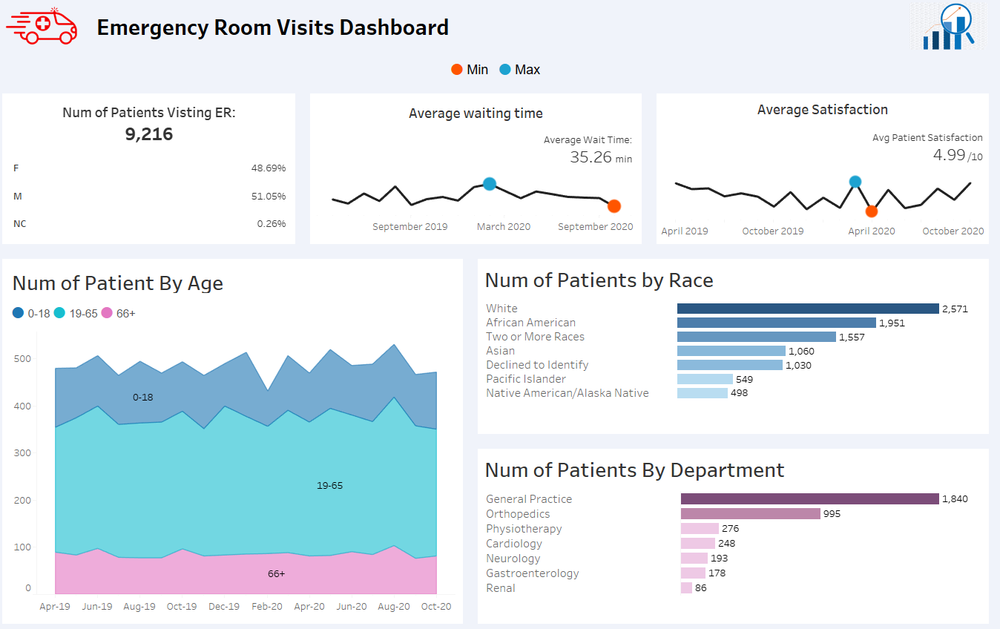

### Hospital Emergency Room Analysis

##### Tried to do US Healthcare for first time, didnt found godod dataset

#### Dashboard View

    

### HOW TO USE:

Just Open .twbx file provided for Tableau -> represents tableau packaged work book that contains all data + dashboard

Open .pbix file for powerBI report that is not complete yet

You can read documentation provided in pdf form to know how this was built along with calculated fields.
